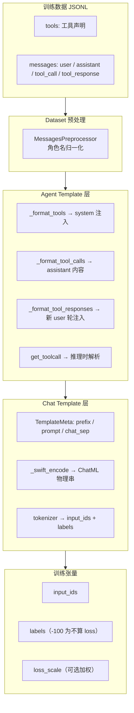
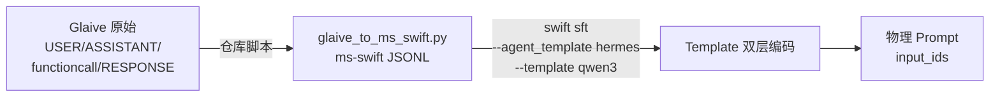

# ms-swift 训练数据 → 模型物理格式 转换模板体系调研报告

> 环境：ms-swift **4.0.1**（`/usr/local/lib/python3.11/site-packages/swift`）  
> 调研时间：2026-06-18  
> 关联项目：`tool_use`（Qwen3 + Hermes + Glaive FC v2）

---

## 1. 总览：双层模板架构

ms-swift 将「训练 JSONL → 模型可训练的 token 序列」拆成 **两层正交模板**，分别负责 **对话骨架** 与 **工具调用语义**：



| 层级 | 类 / 注册表 | 职责 | 典型配置 |
|------|-------------|------|----------|
| **Chat Template** | `Template` + `TemplateMeta` + `TEMPLATE_MAPPING`（210 种） | 模型专属对话格式（ChatML、Llama3 等），拼接 system/user/assistant，生成 token | Qwen3 → `template_type=qwen3` |
| **Agent Template** | `BaseAgentTemplate` + `agent_template_map`（23 种） | 工具声明、tool_call、tool_response 的文本/XML 格式 | Qwen 系默认 → `hermes` |

二者在 `Template.__init__` 中组合：`self.agent_template = agent_template_map[agent_template]()`。

---

## 2. 标准训练数据格式（ms-swift Agent JSONL）

框架期望的 **逻辑中间格式**（本项目 `glaive-ms-swift.jsonl` 即此格式）：

```json
{
  "tools": "[{\"type\":\"function\",\"function\":{\"name\":\"get_weather\",...}}]",
  "messages": [
    {"role": "user", "content": "上海今天天气怎么样？"},
    {"role": "assistant", "content": "好的，我来查询。"},
    {"role": "tool_call", "content": "{\"name\":\"get_weather\",\"arguments\":{\"city\":\"上海\"}}"},
    {"role": "tool_response", "content": "{\"temperature\":25,\"condition\":\"晴\"}"},
    {"role": "assistant", "content": "上海今天晴，25度。"}
  ]
}
```

### 2.1 支持的角色（经 `MessagesPreprocessor` 归一化）

| 标准 role | 别名 / 来源 |
|-----------|-------------|
| `user` | `human` |
| `assistant` | `gpt`, `bot` |
| `system` | `system_prompt` |
| `tool_call` | `function_call` |
| `tool_response` | `function_response`, `observation`, `observations` |

> 注：`StdTemplateInputs.from_dict` 还会把 `tool_response` 映射为 `tool`，与 HuggingFace chat template 兼容。

### 2.2 顶层字段

| 字段 | 说明 |
|------|------|
| `messages` | 必填，多轮对话 |
| `tools` | 可选，OpenAI function 格式或 JSON 字符串 |
| `system` | 可选；也可放在 messages 首条 role=system |

---

## 3. 完整转换流水线

### 3.1 入口：`Template.encode()`

```python
# swift/template/base.py
def encode(inputs) -> dict:
    # 返回 {'input_ids', 'labels', 'loss_scale', ...}
```

训练模式（`template.set_mode('train')`）下保留 `labels`；推理模式会 `remove_response` 并去掉 labels。

### 3.2 阶段一：Dataset 行预处理

**类**：`swift/dataset/preprocessor/core.py` → `MessagesPreprocessor`

- 列名映射：`conversation` / `conversations` → `messages`
- ShareGPT 格式 → 标准 messages
- 角色名归一化为 `user/assistant/tool_call/tool_response/system`

### 3.3 阶段二：`_preprocess_inputs()` — Agent 语义改写

**核心函数**：`Template._preprocess_function_call()` + `_swift_prepare_inputs()`

#### Step A：`tool_call` → `assistant` 文本

```python
# 连续 tool_call 消息合并，经 agent_template._format_tool_calls 格式化
messages[i] = {'role': 'assistant', 'content': '<tool_call>...</tool_call>'}
```

Hermes 示例输出：

```xml
<tool_call>
{"name": "get_weather", "arguments": {"city": "上海"}}
</tool_call>
```

#### Step B：`tool_response` → 注入为新「user 轮」

当检测到 `assistant` 后紧跟 `tool`/`tool_response`：

```python
pre_content, tool_content = agent_template._format_tool_responses(pre_content, tool_messages)
# Hermes: tool_content 变为 ChatML user 轮的 prompt 片段
# 含 <tool_response>...</tool_response>
```

**这是 Hermes 的关键设计**：工具返回不占 assistant 轮，而是 **伪装成下一轮 user 输入**。

#### Step C：`tools` → 写入 system

```python
system = agent_template._format_tools(tools, system, user_message)
```

Hermes 在 system 末尾追加 `<tools>...</tools>` 及调用说明。

### 3.4 阶段三：`_swift_encode()` — Chat 骨架拼接

基于 `TemplateMeta`（Qwen 系继承 `ChatmlTemplateMeta`）：

```
system_prefix: <|im_start|>system\n{{SYSTEM}}\n
prompt:        <|im_start|>user\n{{QUERY}}\n<|im_start|>assistant\n
chat_sep:      \n
suffix:        \n
```

按 **user/assistant 交替轮** 展开；`tool` 轮作为 query 侧特殊 prompt 插入。

最终 `_encode_context_list` → tokenizer → `input_ids` / `labels`。

### 3.5 阶段四：Loss 掩码与加权

| 机制 | 说明 |
|------|------|
| **labels** | prompt 部分为 `-100`（不算 loss），assistant 部分为 token id |
| **loss_scale** | 默认 `default`：仅 assistant 响应计 loss；可选 `last_round` / `all` |
| **Agent 加权** | `--loss_scale hermes` 时，`<tool_call>...</tool_call>` 区域权重 ×2 |

`hermes.json` 配置：

```json
{"<tool_call>.+?</tool_call>": [2.0]}
```

---

## 4. Agent Template 注册表（23 种）

来源：`swift/agent_template/mapping.py`

| 名称 | 类 | 适用场景 |
|------|-----|----------|
| **hermes** | `HermesAgentTemplate` | Qwen 默认；XML `<tool_call>` / `<tool_response>` |
| hunyuan_hermes | `HunyuanHermesAgentTemplate` | 混元变体（JSON 代码块包裹参数） |
| qwen_en / qwen_zh | `QwenEn/ZhAgentTemplate` | Qwen 原生 ✿FUNCTION✿ / ✿ARGS✿ 格式 |
| qwen_en_parallel / qwen_zh_parallel | 并行多工具 | |
| qwen3_coder | `Qwen3CoderAgentTemplate` | 代码模型；`<function=...>` 嵌套 XML |
| qwen3_5 | `Qwen3_5AgentTemplate` | Qwen3.5 多模态 |
| react_en / react_zh | ReAct 文本格式 | Thought/Action/Observation |
| llama3 / llama4 | Llama 工具格式 | |
| glm4 / glm4_5 / glm4_7 / chatglm4 | 智谱系列 | |
| deepseek_v3_1 | DeepSeek V3.1 | |
| mistral / minimax_m2 / seed_oss / youtu / toolbench | 各厂商定制 | |
| react_grpo | GRPO 训练专用 | |

### 4.1 Hermes 三件套（本项目使用）

| 方法 | 训练方向 | 作用 |
|------|----------|------|
| `_format_tools` | 编码 | system 注入工具 JSON + 调用规范 |
| `_format_tool_calls` | 编码 | `tool_call` role → assistant 内的 XML JSON |
| `_format_tool_responses` | 编码 | 工具结果 → 下一轮 user 的 `<tool_response>` |
| `get_toolcall` | 解码 | 正则提取 `<tool_call>` 内 JSON → `Function` 列表 |

### 4.2 Qwen Chat Template 默认绑定

```python
# swift/template/templates/qwen.py
@dataclass
class QwenTemplateMeta(ChatmlTemplateMeta):
    agent_template: str = 'hermes'  # 默认 agent 模板
```

Qwen3 注册为 `LLMTemplateType.qwen3`，带 thinking 混合前缀；Coder 系单独绑定 `qwen3_coder`。

---

## 5. Chat Template 注册表（210 种）

来源：`swift/template/register.py` → `TEMPLATE_MAPPING`

- **注册方式**：各模型文件 `@register_template(TemplateMeta(...))`
- **元数据结构** `TemplateMeta`：`prefix`, `system_prefix`, `prompt`, `chat_sep`, `suffix`, `default_system`, `agent_template`, thinking 相关字段
- **实例化**：`get_template(processor, template_type=..., agent_template=...)`

Qwen3 使用 **ChatML** 变体（`ChatmlTemplateMeta`），与 HuggingFace `tokenizer.apply_chat_template` 对齐。

### 5.1 双 Backend

| backend | 路径 | 特点 |
|---------|------|------|
| **swift**（默认训练） | `_swift_encode` | 精细控制 loss_scale、tool 注入、多轮 |
| **jinja**（部分推理） | `_jinja_encode` | 直接 `tokenizer.apply_chat_template` |

Tool-Use SFT **必须走 swift backend**，否则 tool_call/tool_response 预处理无效。

---

## 6. 物理 Prompt 示例（Qwen3 + Hermes）

本项目 `chat_agent.py encode` 命令可复现：

```text
<|im_start|>system
{default_system}

# Tools
...
<tools>{"type":"function","function":{...}}</tools>
...

<|im_start|>user
上海今天天气怎么样？
<|im_start|>assistant
<tool_call>
{"name": "get_weather", "arguments": {"city": "上海"}}
</tool_call>
<|im_start|>user
<tool_response>
{"temperature": 25, "condition": "晴"}
</tool_response>
<|im_start|>assistant
上海今天晴，25度。
```

---

## 7. 与本项目的映射关系



| 项目组件 | ms-swift 对应 |
|----------|---------------|
| `data_process/glaive_to_ms_swift.py` | 外部数据 → 标准 Agent JSONL（框架不负责） |
| `train.sh --agent_template hermes` | 选用 `HermesAgentTemplate` |
| Qwen3-4B 模型 | 自动匹配 `template_type=qwen3` |
| `chat_agent.encode` | `template._preprocess_inputs` + `template.encode` |
| `eval_tool_selection.py` | 推理侧 `LocalEngine` 同一套 template |

---

## 8. 关键 API 速查

| 目的 | API / 参数 |
|------|------------|
| 指定工具格式 | `--agent_template hermes` |
| 指定对话格式 | `--template qwen3`（通常随模型自动选择） |
| 控制 loss 范围 | `--loss_scale default` / `hermes` / `last_round+hermes` |
| 最大序列长度 | `--max_length 4096` |
| 查看物理 prompt | `template.set_mode('train'); template.encode(InferRequest(...))` |
| 推理解析工具 | `template.agent_template.get_toolcall(response_text)` |

---

## 9. 扩展与注意事项

1. **Agent Template 与 Chat Template 必须匹配模型族**：Qwen 用 Hermes/Qwen 系；Llama 用 llama3；混用会导致解析失败。
2. **`tool_call` 不要手写 XML**：JSONL 中保持 `role: tool_call` + JSON content，XML 由 `_format_tool_calls` 生成。
3. **多 tool_call 并行**：连续多条 `tool_call` 会在预处理阶段合并为一个 assistant 块。
4. **Qwen3 thinking 模型**：`Qwen3MixedTemplateMeta` 会自动加/剥 `<think>` 块，与 tool_call 独立。
5. **自定义模板**：继承 `BaseAgentTemplate` 实现 4 个抽象/核心方法，注册到 `agent_template_map`；Chat 侧继承 `TemplateMeta` 并 `register_template`。
6. **ms-swift 4.x 参数**：训练用 `--target_modules`（非 `--lora_target_modules`）、保留 `--torch_dtype`（非 `--dtype`）。

---

## 10. 源码索引

| 模块 | 路径 |
|------|------|
| Chat Template 基类 | `swift/template/base.py` |
| Template 注册 | `swift/template/register.py` |
| Qwen 模板定义 | `swift/template/templates/qwen.py` |
| ChatML 元模板 | `swift/template/templates/utils.py` |
| 输入数据结构 | `swift/template/template_inputs.py` |
| Agent 基类 | `swift/agent_template/base.py` |
| Hermes 实现 | `swift/agent_template/hermes.py` |
| Agent 注册表 | `swift/agent_template/mapping.py` |
| 数据集预处理 | `swift/dataset/preprocessor/core.py` |
| Loss 加权 | `swift/loss_scale/` |

---

## 11. 结论

ms-swift 的「模板体系」本质是：

1. **Dataset 层**：把异构 JSONL 统一成 `messages + tools` 标准结构；
2. **Agent Template 层**：把 tool 语义转成模型可读的 **system 工具表 + assistant tool_call + user tool_response**；
3. **Chat Template 层**：把多轮 messages 套进 **模型专属 ChatML（或其它）骨架**，再 tokenize 为 `input_ids/labels`。

对本项目而言，**Glaive → ms-swift JSONL** 是数据工程；**Hermes + Qwen3 ChatML** 是框架内置、训练时自动执行的转换模板。理解分界点在于：`tool_call` / `tool_response` 在 JSONL 中是逻辑角色，在物理 Prompt 中会被 Hermes **重写进 ChatML 的 system / assistant / user 三轮结构**。
